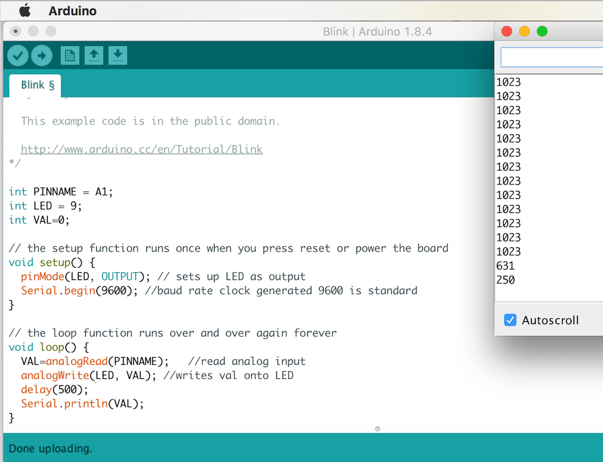
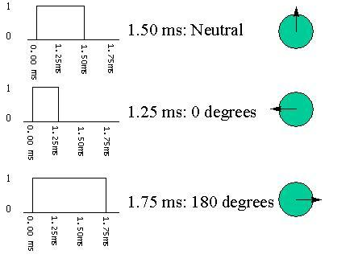
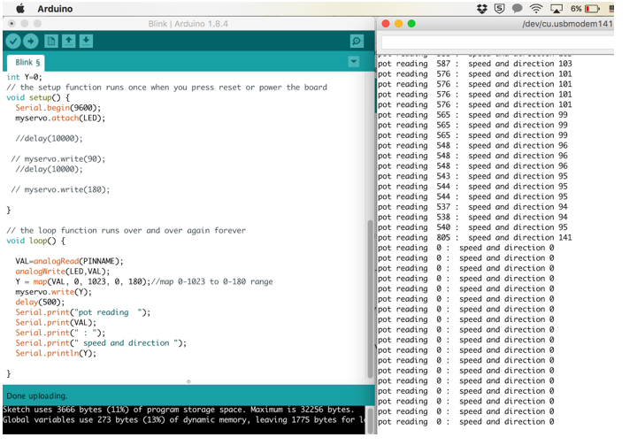

# Lab 1: Microcontroller

[Lab 1 Handout](https://cei-lab.github.io/ece3400/lab1.html)

This lab was an introductory lab aimed to help us gain familiarity with the Arduino Uno and the Arduino IDE. Using these alongside other external components allowed us to ultimately create an autonomous robot that moved in a four sided path. Each part to this lab is outlined below, as well as the intermediate steps we took.


### Part 1: Blinking an internal LED 
###### (Jidenna)

coming soon


### Part 2: Blinking an external LED 
###### (Jidenna)

coming soon


### Part 3: Reading the value of a potentiometer via the serial port 
######  (Asad)

coming soon


### Part 4: Map the value of the potentiometer to the LED 

This next exercise is a wonderful way to understand the different inputs and outputs of the arduino. So in the previous exercise we’ve read the value of the potentiometer via the serial port, but for this next step we want to use the potentiometer to change the intensity of an LED light. 

To review, the potentiometer inputs different analog voltages that we can adjust from 0 to 1023, 1023 being the highest and 0 the lowest.However, the arduino can only output digital signals. The way to get around this is to connect the LED to a digital pin with PWM capability (pins marked with ~). 

  * As you can see in the image below, we printed the potentiometer readings as before, so that we could keep track of changing readings. 




  * You may also notice we used analogWrite. The reason for this is that the potentiometer readings obviously don’t directly translate into LED intensities. We had to map the values of the potentiometer to the brightness levels of the LED separately.

  * To see the demo of the LED changing intensity, look below in the demo section


### Part 5: Map the value of the potentiometer to the servo 

The rotation of the servos can be controlled by changing the angle values:
   * First angle values were changed by entering numbers from 0 to 180 from the key board. (90 -stop, 0 - full speed reverse, 180 - full speed ahead)


     
   * Then we used the potentiometer to provide an analog signal which controls the rotation speed and direction
   * A map function was used to map resistance readings from potentiometer (0 to 1023) to 0 to 180 range


   
   * We also measured the frequecncy of the signal using oscilloscope which was around 50 Hz and the duty cycle increased as the angle increased.(Checkout the Demos section)
   

### Part 6: Assemble your robot 
###### (Rohit) will add images

We began assembly of the robot by mounting two servos under the chassis board with premade servo mounts. We choice wheels that would fit the servos without additional adjustments. The wheels sit on the back of the robot, so we needed something to hold up the front. We used a ball bearing in the front. We ran into issues with the height of the ball bearning and had to use a longer 3D printed ball bearing mount to keep the ball bearing and chassis level to the floor. 

We used:
  * 9V battery to power the servos, which we attached under the chassis board with velcro. 
  * a velcro to attach a rechargable battery pack to the top of the board to power the arduino and a breadboard on top of the battery pack. 

The wiring was simple and done on the breadboard. The PWM digital output pins 5 and 6 were used to control the servos. Each servo used identical circuitry. The digital pins were connected to the servos through a 300 Ohm resistor. The 9V battery supplied the voltage for the servos and the ground on the breadboard was connected to the ground on the arduino.


### Part 7: Driving your robot autonomously 
###### (John)

Once the assembly of the robot was completed, we decided that the robot should make a square. The robot would start at the center of the square and move outward to make the square. The robot would travel one second outward from the center to one of the sides of the square. 
  * The robot turns to the left onto one of the sides of the square and then it travels for another second to reach the first corner of the square. 
  * After exiting the center of the square, the loop controls the robot to travel in a square. At first, the robot was making a triangle, but after tuning the timing of the turns we got the robot to make more of the square. However, with our current implementation the “square” rotates.

```arduino
  rightServoAngle = 180;
  leftServoAngle = 0;
  
  rightMotor.write(rightServoAngle);
  leftMotor.write(leftServoAngle);

  delay(1000);
```

## Helpful links and References
This website gives an overview of servos and rotation angles: [Servo](http://www.seattlerobotics.org/guide/servos.html)
This website helped with embedding code: [Embed Code](https://help.github.com/articles/creating-and-highlighting-code-blocks/)

## Demos
  * [Oscilloscope measurements for 0, 90 and 180 degree rotations](https://www.youtube.com/watch?v=w-dbIPHahbE&feature=youtu.be)

* [LED intensity adjustment using potentiometer reading](https://youtu.be/VkdjhSLH_bo)
