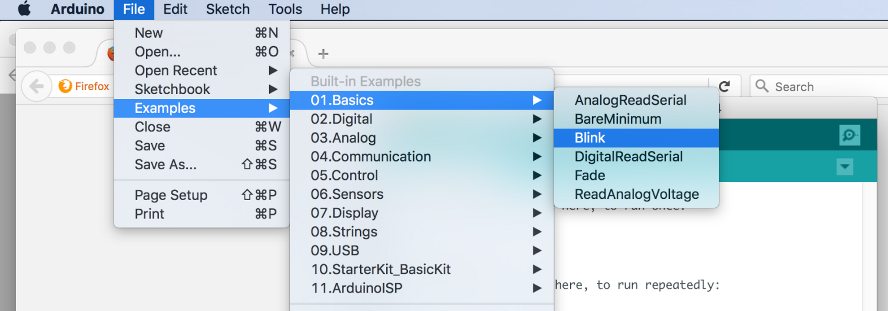
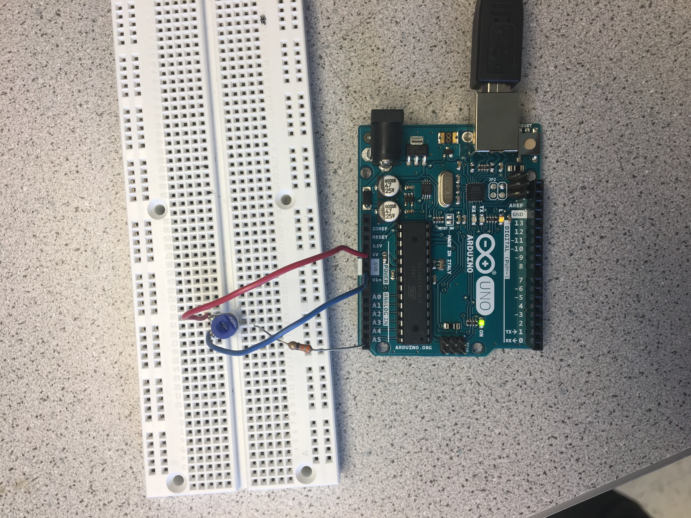
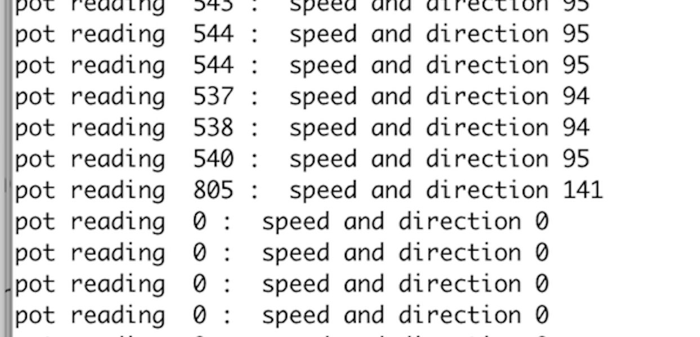

# Lab 1: Microcontroller

This lab was an introductory lab aimed to help us gain familiarity with the Arduino Uno and the Arduino IDE. Using these alongside other external components allowed us to ultimately create an autonomous robot that moved in a four sided path. Each part to this lab is outlined below, as well as the intermediate steps we took.


### Part 1: Blinking an internal LED 

The first part of the lab was necessary for us to get a feel of how to code in Arduino and how the IDE and Uno communicate with each other. The goal was to write code that turned on and off the internal LED installed onto the Arduino UNO board itself. To achieve this we first used the USB A/B to connect the board to our computer, then opened up the Arduino IDE and selected the previously written example code named Blink, as you can see below.



This will generate the code that turns on and off the LED on the Uno board. At this point we took a second to understand the mechanics of the code and how it actually connected to each component. We realized that it was necessary to have a setup function in which all necessary components are initialized and a loop function that carries out the desired task. 

The final step is to compile the code by clicking the checkmark and then upload it to the Uno by clicking the right arrow next to the checkmark. Shortly, the LED on the Uno should begin to flicker! If the LED doesn’t light up, make sure to check that the UNO is connected to the correct COM port by looking at the Tools > Serial Port list.


### Part 2: Blinking an external LED 

The next part of the lab was modifying the code so that it would work with an external LED that was set up on a breadboard. This part allowed us to practice writing our own code and taught us how to check that each digital pin of the Uno worked correctly. To do this we set up the external LED, making sure to also put a resistor in series with the light as pins can malfunction if you run too much current from them. Use a minimal of a 300 ohm resistor to prevent this from happening. 

Then we altered the code to test all 14 digital pins present on the Uno by connecting the LED to a single pin on the Uno, then changing the code to initialize that specific pin. Compile and upload the code and the external LED should light up! Repeat this for all 14 pins to ensure that each digital pin works correctly. 

See the Demos below to look at the LEDs!


### Part 3: Reading the value of a potentiometer via the serial port 

The previous exercise made use of setting a digital pin to output mode, in order to blink the LED using a simple resistor circuit. This exercises, on the other hand, incorporated the UNO's analog pins and set them to input mode towards the purposes of reading voltage levels. A potentiometer was used to vary the the voltage levels supplied to the UNO. 

The potentiometer has three pins, two of which were connected to PWR or GND. The third pin was connected to our analog pin and set as an input (to receive and read voltages). Similar to our other circuit iterations, we placed a ~300 Ω resister in series with the input pin (A5) that directly interfaces with the breadboard. A5 was passed into the analogRead() function to periodically read the circuit's voltage. To display our results, the serial monitor was initialzied in the setup() block with a baud rate of 9600, and the read voltage value was written to the serial port after every half second interval.

Upon uploading our code, the serial port outputted a value from 0 to 1023 every half second; these readings could be adjusted depending on the knob position of the potentiometer. Below is an image of the circuit we constructed for this exercise.



The code used to carry out the function explained above is shown here.

```arduino
const int analogInPin = A5;

int sensorValue = 0;

void setup() {
  Serial.begin(9600);
}

void loop() {
  sensorValue = analogRead(analogInPin);
  Serial.print("sensor = ");
  Serial.println(sensorValue);
  delay(500);
}
```

### Part 4: Map the value of the potentiometer to the LED 

This next exercise is a wonderful way to understand the different inputs and outputs of the arduino. So in the previous exercise we’ve read the value of the potentiometer via the serial port, but for this next step we want to use the potentiometer to change the intensity of an LED light. 

To review, the potentiometer inputs different analog voltages that we can adjust from 0 to 1023, 1023 being the highest and 0 the lowest.However, the arduino can only output digital signals. The way to get around this is to connect the LED to a digital pin with PWM capability (pins marked with ~). 

  * As you can see in the image below, we printed the potentiometer readings as before, so that we could keep track of changing readings. 


  * You may also notice we used analogWrite. The reason for this is that the potentiometer readings obviously don’t directly translate into LED intensities. We had to map the values of the potentiometer to the brightness levels of the LED separately.

  * To see the demo of the LED changing intensity, look below in the demo section


### Part 5: Map the value of the potentiometer to the servo 

The rotation of the servos can be controlled by changing the angle values:
   * First angle values were changed by entering numbers from 0 to 180 from the key board. (90 -stop, 0 - full speed reverse, 180 - full speed ahead)


     
   * Then we used the potentiometer to provide an analog signal which controls the rotation speed and direction.
   * A map function was used to map resistance readings from potentiometer (0 to 1023) to 0 to 180 range.
   
   ```arduino
  void setup() {
  Serial.begin(9600);
  myservo.attach(LED); 
   }
// the loop function runs over and over again forever
void loop() {
 
  VAL=analogRead(PINNAME);
  analogWrite(LED,VAL);
  Y = map(VAL, 0, 1023, 0, 180);//map 0-1023 to 0-180 range

myservo.write(Y);
  delay(500);
  Serial.print("pot reading  ");
  Serial.print(VAL);
  Serial.print(" : ");
  Serial.print(" speed and direction ");
  Serial.println(Y);
}
   ``` 

   
   * We also measured the frequecncy of the signal using oscilloscope which was around 50 Hz and the duty cycle increased as the angle increased.(Checkout the Demos section!)
   

### Part 6: Assemble your robot 
###### (Rohit) will add images


We began assembly of the robot by mounting two servos under the chassis board with premade servo mounts. We choice wheels that would fit the servos without additional adjustments. The wheels sit on the back of the robot, so we needed something to hold up the front. We used a ball bearing in the front. We ran into issues with the height of the ball bearning and had to use a longer 3D printed ball bearing mount to keep the ball bearing and chassis level to the floor. 

 We used:
  * 9V battery to power the servos, which we attached under the chassis board with velcro. 
  * a velcro to attach a rechargable battery pack to the top of the board to power the arduino and a breadboard on top of the battery pack. 

The wiring was simple and done on the breadboard. The PWM digital output pins 5 and 6 were used to control the servos. Each servo used identical circuitry. The digital pins were connected to the servos through a 300 Ohm resistor. The 9V battery supplied the voltage for the servos and the ground on the breadboard was connected to the ground on the arduino.


### Part 7: Driving your robot autonomously 

Once the assembly of the robot was completed, we decided that the robot should make a square. 

Here is how the robot navigates:

 * It would start at the center of the square and move outward to make the square. 
 
 * It would travel one second outward from the center to one of the sides of the square. 
 
 * It turns to the left onto one of the sides of the square and then it travels for another second to reach the first corner of the square. 
 * After exiting the center of the square, the loop controls the robot to travel in a square. 

At first, the robot was making a triangle, but after tuning the timing of the turns we got the robot to make more of the square. However, with our current implementation the “square” rotates.

In our implementation of the robot, we kept track of the "angle" for each of the servo motors. To go in either the forward or the backwards direction, the servo "angles" must be in opposite directions from the 90-degree center. For example to go forward, the right servo angle is 180-degrees while the left servo angle is 0-degrees. This is because the servo motors are not oriented in the same direction. 

```arduino
 // This code makes the robot go forward for 2 seconds
 // Variables to hold servo angles
 rightServoAngle = 180;
 leftServoAngle = 0;
  
 rightMotor.write(rightServoAngle);
 leftMotor.write(leftServoAngle);
 
 delay(2000);
```

To turn left, we set the servo "angle" to 0-degrees for motors. The angle of the turn was determined by how long the robot is in the turning state. To get about a 90-degree turning angle, we set the delay to 600 milliseconds.

See below for the demo!


## Helpful links and References
This website gives an overview of servos and rotation angles: [Servo](http://www.seattlerobotics.org/guide/servos.html)

This website helped with embedding code: [Embed Code](https://help.github.com/articles/creating-and-highlighting-code-blocks/)

This was used for website formatting: [Formatting Syntax](https://help.github.com/articles/basic-writing-and-formatting-syntax/#styling-text)

## Demos
  * [Internal blinking LED](https://youtu.be/CbI8GjtLzWQ) 
  
  * [External Blinking LED](https://youtu.be/xxHM0qjRCVw)

  * [Oscilloscope measurements for 0, 90 and 180 degree rotations](https://www.youtube.com/watch?v=w-dbIPHahbE&feature=youtu.be)

  * [LED intensity adjustment using potentiometer reading](https://youtu.be/VkdjhSLH_bo)

  * [Robot moving in square path](https://www.youtube.com/watch?v=yF6Pmu4LxbU)
