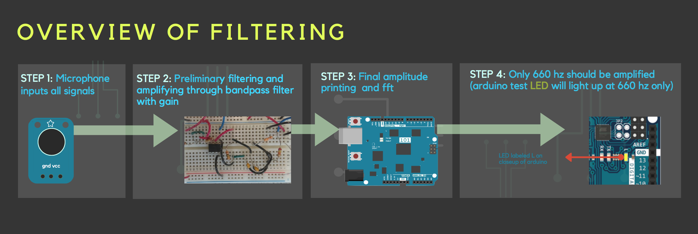
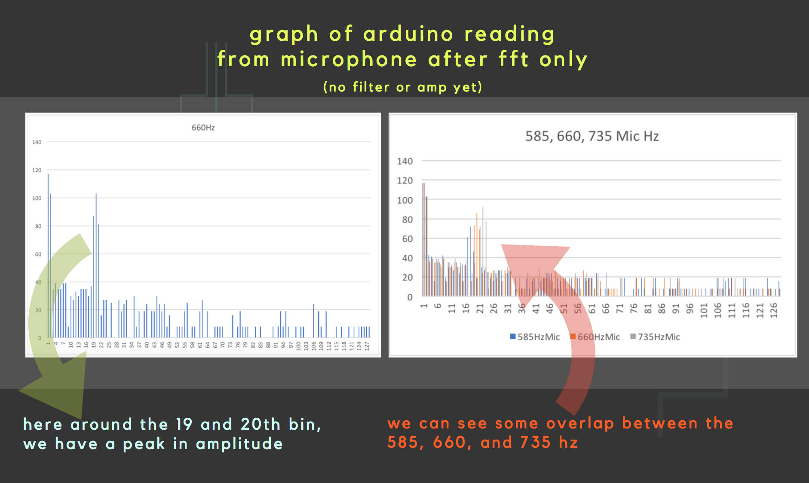
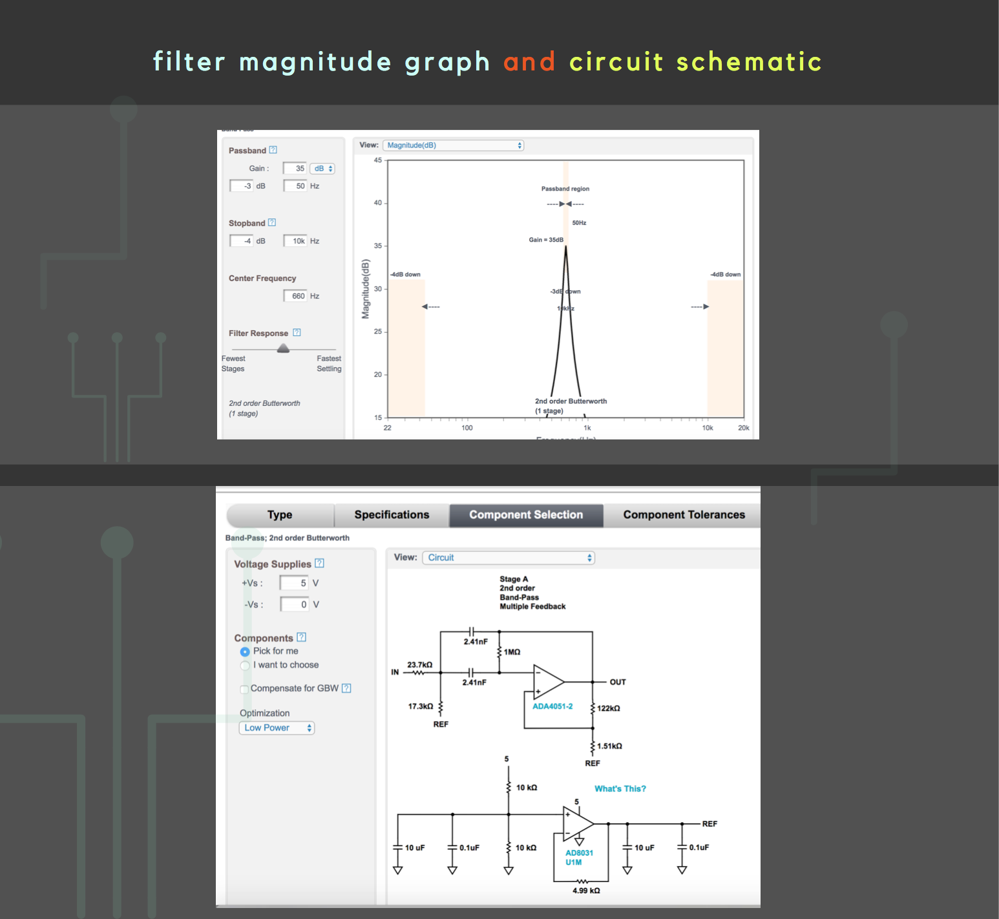
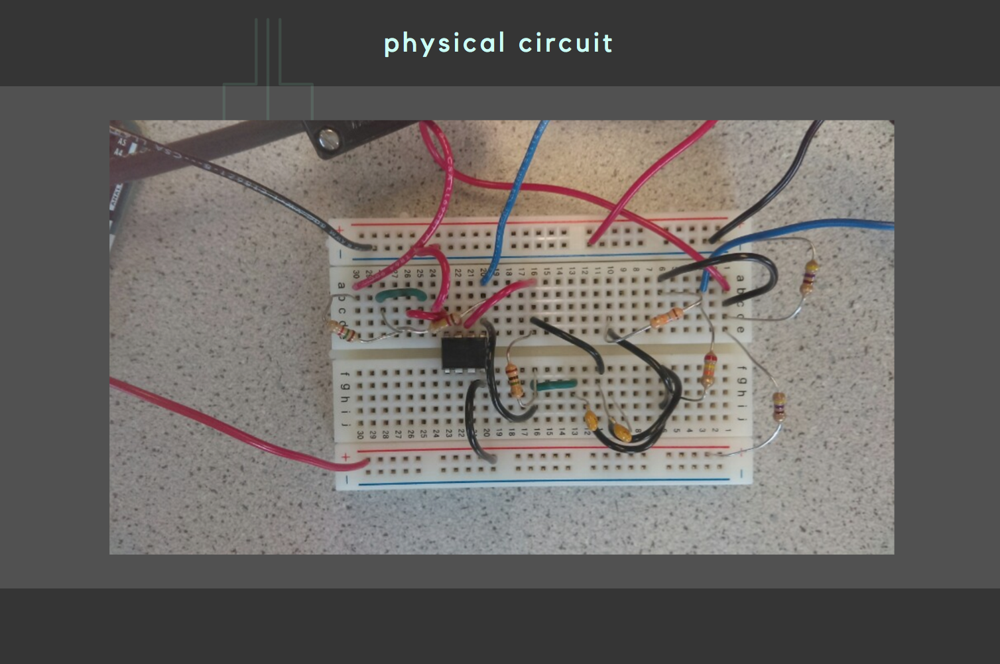

For this lab, we split up into 2 subteams blah blah blah

[Find the original lab manual here.](https://cei-lab.github.io/ece3400/lab2.html) 


The goal of this sublab was to enable our robot to detect a 660hz frequency. In order to do this we had to:
  * do a correct FFT analysis, 
  * have a working amplifier circuit and 
  * also be able to distinguish a 660 hz from a 585hz and 735 hz. 

This acoustic aspect of the lab is important because later on the robot will use this 660Hz signal as its start signal.
The following is a visual overview of what we want to accomplish



**Introduction**

For this lab, we needed a microphone, arduino uno, and some resistors and capacitors. 
In the past years, the class used a different mic, which is why they previously made a separate microphone circuit. The microphone we used (MAX4466) already came with a low pass filter, which meant that we would not have to do this first step.

First we coded an FFT using the example sketch available in the Open Music Lab library. However, the range of values it provided was still too large to be able to determine the difference between 585, 660, and 735hz satisfactorily. Thus, we created a filter with gain with the dual purpose of narrowing the range and also amplifying. Thus the mic outputs to the filter which then outputs to the arduino and we can interact with the data by printing the values the arduino reads.

To check if the microphone worked properly, we connected it to the arduino and hooked it up to the oscilloscope, turned on a 660hz tone (adjusting the potentiometer on the microphone slightly) and adjusted the scale. In the video, the oscilloscope reads very close to 660 Hz, reconfirming that the microphone is working, and it has read the correct 660hz value we played.

[microphone check video](https://www.youtube.com/watch?v=bH1wr-NfdV0)

**FFT analysis**

For this part of the lab we decided to use analogRead. Note that when we use fft_input, each index i that is even represents a real signal, whereas the odd signals are the imaginary components. Thus in the loop:

```
 for (int i = 0 ; i < 512 ; i += 2) { // save 256 samples
      fft_input[i] = analogRead(A0); // put real data into even bins
      fft_input[i+1] = 0; // set odd bins to 0
```

We have the the even index 1 equal to the analogRead from pin A0, an i+1 index (the odd one) equal to zero.
Then the for loop is incremented by two for each bin.

To check the code and make sure it was working correctly, we hooked it up to the function generator and the oscilloscope to make sure the function generator was outputting as well. We had the arduino print out the values, then we transfered that data to excel and created a bar graph for each bin and signal. 




To start off, note first the left bar graph which has a peak in either the 19th or the 20th bin. This is supposed to be around the 17th or 18th, but in our case, it does not change our process or matter that much since everything will be relative, and since we have measured with the oscilloscope that it was recieving the same 660Hz created by the function generator. 

We have the other peaks that are the multiples of 660Hz, so that we can be sure the spacing between each peak is equidistant and that the 20 bin number is correct after all.

However, this was not good enough to distinguish from the 585hz and the 735hz. If you look closely at the plot next to it,
you can see that the 585hz and 735hz has overlap somewhat with the 660hz. Thus it is necessary for us to further filter and amplify the signal.


**Amplifier Circuit**

Rather than making a filter and an amplifier separately, we decided to make a bandpass filter with gain.

Using [this website](analog.com/designtools/en/filterwizard/) we mapped out what we wanted our Bode plot to look like, such that our 660 Hz signal would be amplified but all others would be minimized. We first started off with a gain of 40db, or 100. The website then outputs a bandpass filter circuit schematic.





Note that on the website it will output a circuit for voltage range from 5V to -5V, however we want from 5V to 0V. If you change this value, they will give you a REF schematic as well. However this is unnecessary. We simply used a voltage divider to connect the REF and give each 2.5V.

The 2.5 V virtual ground was created by connecting two resistors in parallel? Why did we need to reference our inpur and output resistors to 2.5 volts instead of ground(0 volts)? We did this in order to reduce output swing and gain stability. Instead of swinging between 0 and 5 volts, our output now swings between 2.5 and 5 volts. 




**Distinguishing the 660hz from 585hz and 735hz**

In review, the signal that inputs into the microphone gets preliminarily filtered and amplified by our bypass filter with gain. Then the filter outputs into the A0 input pin of the arduino. The arduino code has different amplitudes in each bin, and we can recall that the 660hz amplitude was around the bin 19 and 20. We then added the following code:

```
    for (byte i = 0 ; i < FFT_N/2 ; i++) { 
      Serial.println(fft_log_out[i]); // send out the data
      if (fft_input[38] > 60)
        digitalWrite(LED_BUILTIN, HIGH);      

```

The purpose of this was to be able to show physically that the arduino responded to the 660hz, rather than the 585hz or the 735hz. We did this by making the arduino LED light up when it detected an amplitude higher than 60 in the 19th bin. Recall that the function fft_input allocates two different indexes for each bin, one real and one imaginary. Thus when we want to reference the 19th bin, we actually have to call the 38th as we did in the above code.

You can see in [this video](https://youtu.be/VzxNFTudYdM) that the LED does not light up during the 585 and 735hz tones. This is because we filtered and amplified only the 660hz, so that the amplitude of the 660hz would be the only one with a significantly high amplitude. The 60 value can be adjusted, however we found that our code worked best with the 60.

**Full code for acoustic team**


