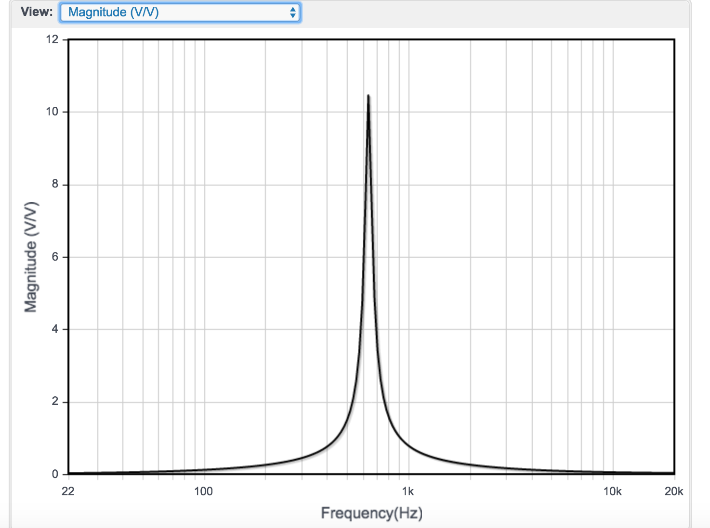
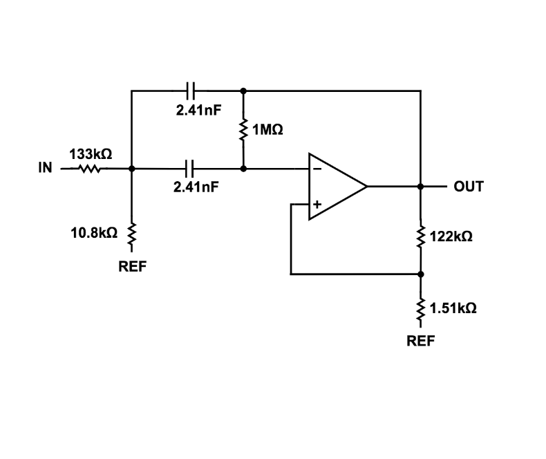

# Lab 2: 
### For this lab, we split up into 2 subteams blah blah blah
[Original Lab Manual Here](https://cei-lab.github.io/ece3400/lab2.html) 


## Acoustic Team:

### The goal of this sublab was to enable our robot to detect a 660hz frequency. In order to do this we had to:

###   > do a correct FFT analysis, 
###   > have a working amplifier circuit and 
###   > also be able to distinguish a 660 hz from a 585hz and 735 hz. 

### This acoustic aspect of the lab is important because later on the robot will use this 660Hz signal as its start signal.


**Introduction**

For this lab, we needed a microphone, arduino uno, and some resistors and capacitors. We did not have to assemble the microphone circuit as in past years since the microphone we used (MAX4466) already came with a low pass filter, which meant that we would not have to use the capacitor and 3 kohm resistor. 

However, we still wanted to check if the microphone worked properly, so we connected it to the arduino (don't forget to power the arduino).

Then we hooked it up to the oscilloscope, turned on the 660 Hz (moving around the potentiometer to change gain) and adjusted the scale. In the video, in the oscilloscope measurement you can see it says 660 Hz, reconfirming that it has read the correct value.

video

**FFT analysis**

Now to filter out other signals, we decided to use analogRead. Note that when we use fft_input, each index i that is even represents a real signal, whereas the odd signals are the imaginary components. Thus in the loop:

```
 for (int i = 0 ; i < 512 ; i += 2) { // save 256 samples
      fft_input[i] = analogRead(A0); // put real data into even bins
      fft_input[i+1] = 0; // set odd bins to 0
```

We have the the even index 1 equal to the analogRead from pin A0, an i+1 index (the odd one) equal to zero.
Then the for loop is incremented by two for each bin.

To check the code and make sure it was working correctly, we hooked it up to the function generator. We also hooked up the oscilloscope to make sure the function generator was outputting as well. We had the arduino print out the values, then we transfered that data to excell and created a bar graph for each bin and signal. 

Bar graph image

*Bar graph image explanation:*
To start off, note first that the bar graph has a peak in the 20th bin, this is supposed to be around the 17th or 18th, but in our case, it does not change our process or matter that much since everything will be relative, and since we have measured with the oscilloscope that it was recieving the same 660Hz created by the function generator. We have the other peaks that are the multiples of 660Hz, so that we can be sure the spacing between each peak is equidistant and that the 20 bin number is correct after all.


**Amplifier Circuit**

We still need to make the amplifier however, because the sound had to be relatively close to the microphone for it to pick up any signal. However rather than making a filter and an amplifier separately, we decided to make a bandpass filter with gain.

Using [this website](analog.com/designtools/en/filterwizard/) we mapped out what we wanted our Bode plot to look like, such that our 660 Hz signal would be amplified but all others would be minimized. We first started off with a gain of 40db, or 100, however we decided to decrease this value to 20db, or 10. The website then outputs a bandpass filter circuit schematic.
Note that on the website it will output a circuit for voltage range from 5V to -5V, however we want from 5V to 0V. If you change this value, they will give you a REF schematic as well. However this is unnecessary. We simply used a voltage divider to connect the REF and give each 2.5V.





