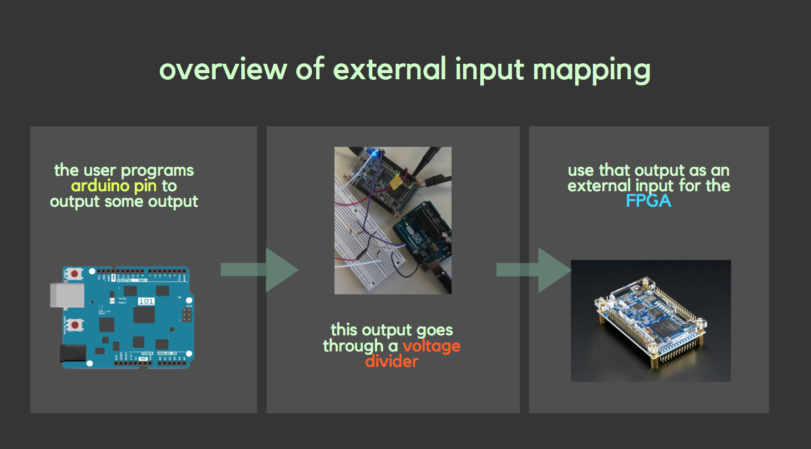
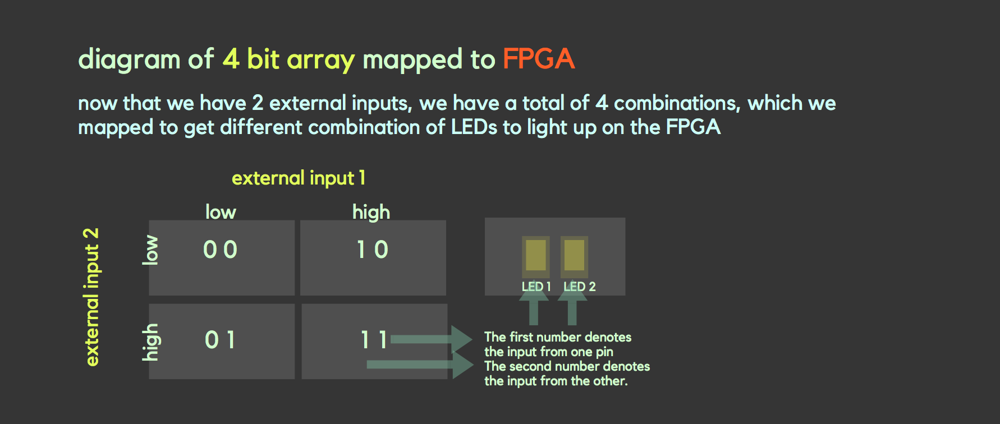
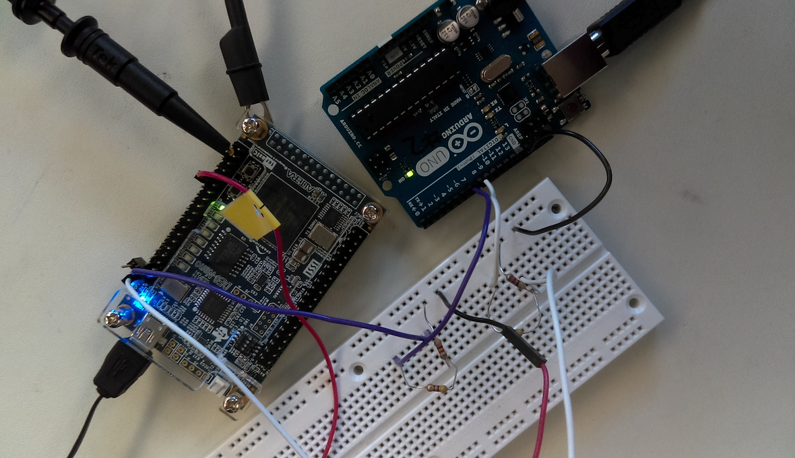
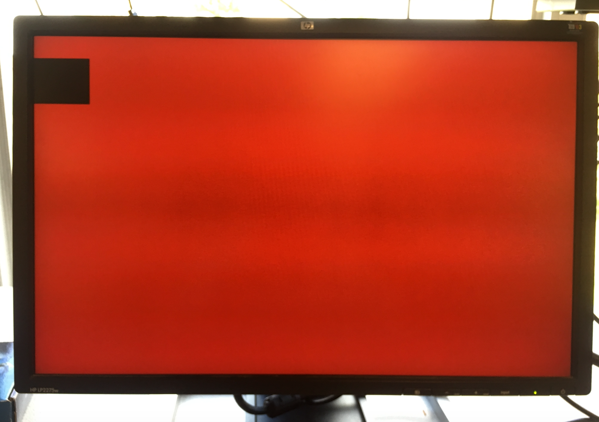
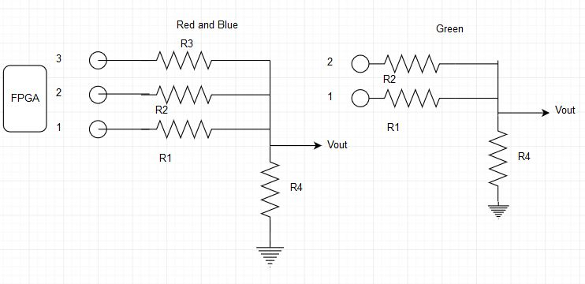
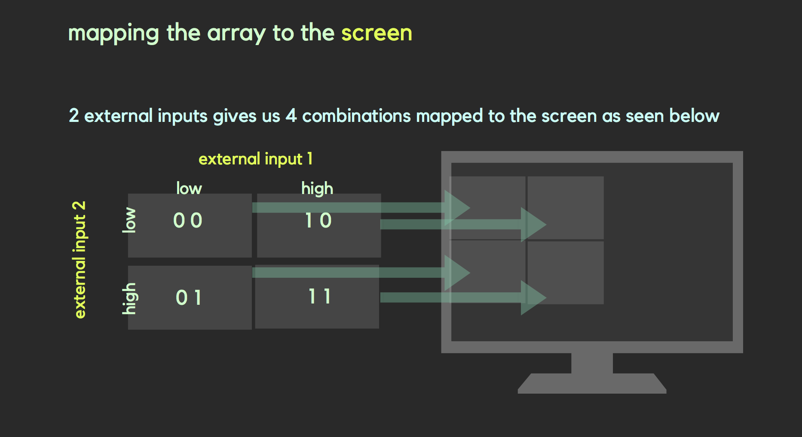
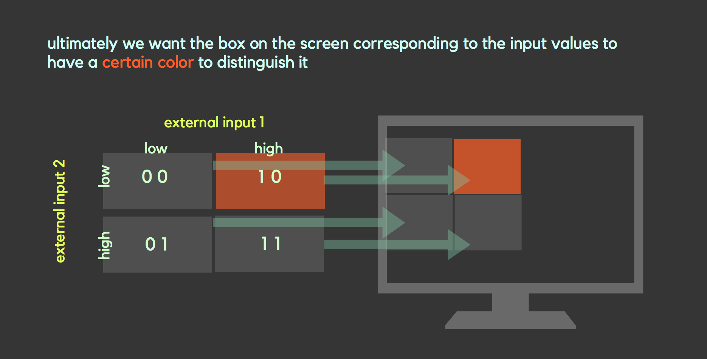
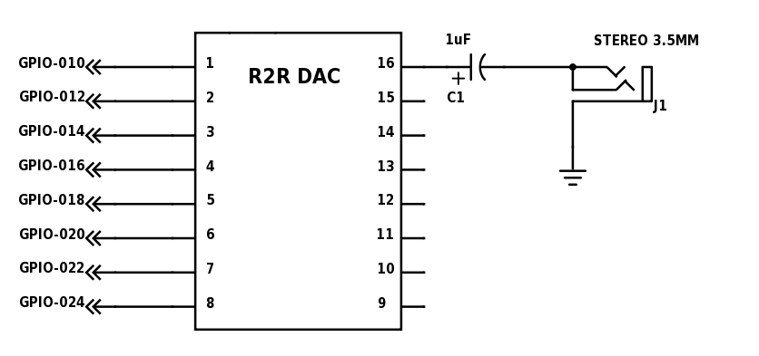
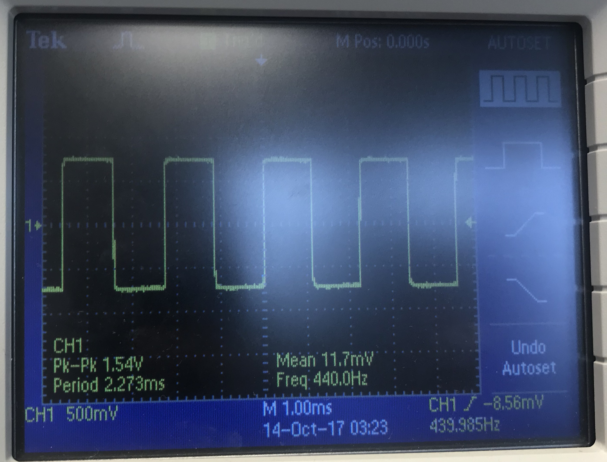

The ultimate goal is to be able to map the robot's path through the maze on a screen using a FPGA and a VGA. In order to do this, the lab was split into multiple steps, each of which will help us achieve that ultimate goal in a later lab: 

- Reading external inputs to FPGA
- Correctly updating a 4-bit array dependent on the inputs 
- Drawing one box on the screen
- Description of how the resistor values were chosen for the DAC
- Mapping external inputs to four different outputs on the screen

## Reading external inputs to FPGA

First before we do anything further, we have to decide what we want to use to produce the external input. In the end, we decided to use the arduino, since this would allow for flexibility and easy manipulation of the output pins since we can code it all via Arduino programming. 

However, one note here is that the arduino pins output 5V, but the FPGA only accepts up to 3.3V. In order to make up for this difference, we used a voltage divider with resistances of roughly 800ohms and 500ohms to turn a 5V based output from the arduino into a 3.3V based input for the FPGA. ( [use this link to find resistor values for a voltage divider](http://www.ohmslawcalculator.com/voltage-divider-calculator) )

For this first part, we basically want to show that the FPGA is reading the input from the arduino. We decided to do this by toggling one of the FPGA LEDs to turn on if the external input was running high, and off if the external input was low. 




To review, we program the arduino outputs, which subsequently go through the voltage divider, which then enter the FPGA as an external input. We will then code the FPGA to toggle the LED on or off based on the external input. 


To best demonstrate this, we programmed the arduino pin to toggle from LOW to HIGH every 2 seconds using the following code within the loop:

``` arduino 
  //External input to FPGA
  //should toggle from HIGH to LOW every 2 seconds
  
  digitalWrite(Pin1, LOW);         // sets the pin low
  digitalWrite(LED_BUILTIN, LOW);  //sets the LED low (just a marker)
  delay(2000);                     // waits for 2 seconds
  digitalWrite(Pin1, HIGH);        // sets the pin high
  digitalWrite(LED_BUILTIN, HIGH); //sets the LED high (just a marker)
  delay(2000);                     // waits for 2 seconds

```
The built in led from the Arduino was used for debugging to check that if our implementation is correct the leds on the FPGA blink simultaneously with the built in LED from the Arduino. 

In our Verilog code for the FPGA, we merely had to equate the LED's current state, led_state, with the external input, such that the HIGH of the external input corresponds to the HIGH of the led_state, and the LOW with the LOW. We did this using the following code:
``` verilog
  always @ (posedge CLOCK_50) begin
        CLOCK_25 <= ~CLOCK_25; 
  		  if (GPIO_0_D[0]== 1'b0) begin
				led_state   <= 1'b0;
		  end
		  else if (GPIO_0_D[0]==1'b1) begin	
				led_state   <= 1'b1;
		  end 
	 end
```

Note in the above code, GPIO_O_D[0] is the pin connected to our external input and led_state refers to the LED's current state.

[See the demo here](https://youtu.be/QqNK1ildkJI)


## Correctly updating a 4-bit array dependent on the inputs

This is similar to the external input to the FPGA with one added aspect. Since we want a 4 bit array, or essentially a 2 by 2 grid array, we can use two inputs from the arduino and map each part of the grid to the corresponding LED on the FPGA.



For the arduino code, we had two outputs, but we wanted to use these outputs to create a total of 4 combinations, as seen on the diagram. As such, we programmed it to toggle through LOW LOW, LOW HIGH, HIGH LOW, and finally HIGH HIGH for output pins 1 and two respectively. This can be seen in the following code.

``` arduino
  //4 bit array mapped to LEDs on FPGA
  //should iterate through 00, 01, 10, 11 
  //2 second intervals
  
digitalWrite(Pin1, LOW);      // sets both the pins low
digitalWrite(Pin2, LOW);      
delay(2000);                  // waits for 2 seconds

digitalWrite(Pin1, LOW);      // sets pin1 low
digitalWrite(Pin2, HIGH);     // sets pin2 high
delay(2000);                  // waits for 2 seconds


digitalWrite(Pin1, HIGH);     // sets pin1 high
digitalWrite(Pin2, LOW);      // sets pin2 low
delay(2000);                  // waits for 2 seconds


digitalWrite(Pin1, HIGH);     // sets both pins high
digitalWrite(Pin2, HIGH);     
delay(2000);                  // waits for 2 seconds
```
For the Verilog code, the only thing that would change is that we need to add another external input and equate it to a second led_state as seen in the following:

``` verilog
    always @ (posedge CLOCK_50) begin

        CLOCK_25 <= ~CLOCK_25; 
  		  if (GPIO_0_D[0]== 1'b0) begin
				led_state   <= 1'b0;
		  end
		  else if (GPIO_0_D[0]==1'b1) begin	
				led_state   <= 1'b1;
		  end 
		  
		  if (GPIO_0_D[1]== 1'b0) begin
				led_state2  <= 1'b0;
		  end
		  else if (GPIO_0_D[1]==1'b1) begin
				led_state2  <= 1'b1;
		  end

```
[See the demo here](https://youtu.be/0PuzwThnux0)

Also here is an image of our voltage divider connected to the arduino and FPGA.


## Drawing one box on the screen

Drawing one box on the screen is independent of the work we've done so far. We will use this later when we use external inputs to change what happens on the screen.

For this first part, we only need to program using Verilog. First from the VGA driver, we receive some pixel x and y coordinate which we declare as a wire in verilog as such:

``` verilog
    wire [9:0]  PIXEL_COORD_X; // current x-coord from VGA driver
    wire [9:0]  PIXEL_COORD_Y; // current y-coord from VGA driver
   
```

We then under structural coding added the following:

``` verilog
always @ (*) begin 
	  if(PIXEL_COORD_X < 10'd64 && PIXEL_COORD_Y < 10'd64) begin
		PIXEL_COLOR <= 8'b000_000_00;
	  end
	  else begin
		PIXEL_COLOR <= 8'b111_000_00;
	  end
end

```

which basically sets up a boundary, such that for each pixel from the VGA driver, if it is located somewhere inside of the 10'd64 box, it will be black, and else it will be a different color, red.



## Description for how resistor values were chosen for VGA
The resistors were used for Digital to Analog conversion of signals from the FPGA to the VGA since VGA uses analog signal where as FPGA uses digital signal. We had 8 resistors total which correspond to the 8 bits used for representing different colors in our code.  
* Three resistors for the red and green color output and two resistors for blue color were used to direct our outputs to the VGA.
* The resistor values were calculated using the concept of voltage division. 
* We calculated the voltage drop across the 50 Ohm resistor (labeled R4) by turning on only one resistor connected to the VGA pin.
* The voltage drop across R4 was determined by the bit that is on and each bit generates an output voltage that is twice the voltage output of the next least significant bit. 

* Red 

   | Resistor    | Voltage output|  Voltage  |calculated  | Measured   |
   | ----------- | ------------- |-----------|----------- |------------|
   | R1  (MSB)   | V1=2V2=4V3    | 4/7V      |238.75 Ohms |269 Ohms    |
   | R2 (2nd MSB)| V2=2V3        | 2/7V      |527.5 Ohms  |552.89Ohms  |
   | R3 (3rd MSB)| V3            | 1/7V      |1105 Ohms   |1179.08 Ohms|
   
* Green
   | Resistor    | Voltage output|  Voltage  |calculated  | Measured    |
   | ----------- | ------------- |-----------|----------- |-------------|
   | R1  (MSB)   | V1=2V2=4V3    | 4/7V      |238.75 Ohms |268.14 Ohms  |
   | R2 (2nd MSB)| V2=2V3        | 2/7V      |527.5 Ohms  |559.4.89 Ohms|
   | R3 (3rd MSB)| V3            | 1/7V      |1105 Ohms   |1180.79 Ohms |
   
   
   * Voltage computations:
   
   *V1+V2+V3 = 1V*
   
   *4V3+2V3+V3 = 1V*
   
   *7V3= 1V*
   
   *V3= 1/7V*
   
   * Resistance computations:
   
   _Vin= 3.3V (input to FPGA)_
   
   _Vi = [R4/(R4+Ri)] x Vin , i= 1,2,3_ 
   
  * Blue 
  
   | Resistor    | Voltage    |  Voltage  |Calcualted|Measured   |
   | ----------- | -----------|-----------|----------|-----------|
   | R1  (MSB)   | V1=2V2     | 2/3       |197.5Ohms |268.31 Ohms|
   | R2 (2nd MSB)| V2         | 1/3       |445Ohms   |567 Ohms   |
   
   Voltage computations:
   
   *V1+V2 = 1V*
   
   *2V2+V2 = 1V*
   
   *3V2= 1V*
   
   *V2= 1/3V*  
   
   Reistance computations for Blue were done by following similar procedure used for green and red colors. 
   
   
      
## Mapping external inputs to four different outputs on the screen.
   
Once we had completed the tasks of correctly updating a 4-bit array with inputs and drawing boxes on the screen, we were finally ready to combine all we had accomplished thus far and map the external inputs to outputs on the computer screen. 

We decided it would make sense to use a 2x2 grid as our output so that we can begin to work on what will eventually be a larger 4x5 grid in future labs. We declared an 8 bit 2x2 array named grid and then assigned each bit to a different color, which would correspond to a different location on the grid.
   
   
   
We then used the code we had initially written to draw one box and updated it so that 4 boxes would appear in a 2x2 grid. Once we were satisfied with our 2x2 grid’s appearance, we then added extra code connecting each box or grid location to our same Arduino external input. Our logic was that if the correct combination of external inputs was set high or low then not only will the LED light up, as was present in previous parts, but also the box corresponding to a location on the grid would be drawn.
   
   
  
   
   [See the demo here](https://youtu.be/ltPyAFzCKdA)
   [See the completed code here](DE0_NANO(fpgatovga).v)
  
  
  
   
In this portion of the lab, we were task with generating audio via an FPGA and an 8-bit R2R DAC. We produced a square wave, a sawtooth wave, and a finite state machine (FSM) based tune (in that order). 

The DAC was connected to the FPGA on pins 15, 17, 19, 21, 23, 25, 27, and 31 on GPIO-0 header. These pins were then connected to DAC pins 1 through 8. The output (pin 16) from the DAC was connected to a 1uF capacitor to block DC voltage from the speaker. The capacitor is then connected to a stereo 3.5mm audio jack. In switching the audio signal on and off we used KEY[1]. The pin that we used when we used the Arduino to trigger the FPGA to play the tune was pin 33.



## Square Wave
In generating a square wave, we just need to toggle all of the pins at the same time. To generate the wave, we calculate that the duration of how long the wave is on and how long of the wave is off with 25MHz / (2 * desired frequency). It is 2 * desired frequency because the always block triggers at the positive edge of the clock signal which results in halving our desired frequency. The resulting number does not always correspond to our desired frequency because we are dealing with discrete numbers. In testing our square wave, we generated a A440 square from the FPGA.


[See square wave demo here](https://www.youtube.com/watch?v=R8MxmX5vwVQ)

## Sawtooth Wave
For the next step of this lab, we chose to generate a sawtooth wave. In the previously outlined square wave, to calculate the step duration of the wave, we used a similar calculation to the that of the square wave generator: [25MHz / (256 * desired frequency)] - 1. The 256 coefficient is needed because the ascent of our wave is split up into 256 steps (256 values for an 8-bit output declared in our Verilog code). We periodocially incremented the output value of the wave, which reverted back to zero after getting to 255 from 0. This range was the basis for our idea of using 256 steps. We subtracted 1 because this adjustment seemed to be just enough compensation for the function generator to consistently produce a wave form with our desired frequencies. 

[see sawtooth wave demo here](https://www.youtube.com/watch?v=u8fw_ki_yeM)


## Turning On/Off Your Sound With an Enable Signal
For turning our sawtooth wave on and off, we used KEY[1]. Our on/off functionality is that if the button is pressed, then the sawtooth wave is off and the sawtooth wave is on when the button is not pressed. Our switch acts like a momentary switch.  

## Multiple Frequency Tune
After being able to play a tune, we wanted the ability to play a short song, which would require playing multiple tunes sequentially. In Verilog, sequentiality can be implemented using FSM. We wanted to play Jaws. This was to be accomplished by playing 4 tones at different frequencies. 

Our formula to calculate how long between each step

*25MHz/(256 * desired frequency) - 1 = step duration*

E_2 *25MHz/(256 * 82.4069Hz) - 1 = 1184*

F_2 *25MHz/(256 * 87.3071Hz) - 1 = 1117*

D_2 *25MHz/(256 * 73.4162Hz) - 1 = 1329*

We had four states for each tone: STATE_1, STATE_2, STATE_3, and STATE_4. We also had an initial state at which nothing is playing and the tone is waiting for the signal to start.

There are two registers to hold state: the current state and the next state. At every positive clock edge there are three cases to check:

1. RESET is high. In this case all the registers including the states are set to their initial values.
2. DONE is high. DONE signals for the tone to start. When it is high, nextState is set to STATE_1. This allows the state to transition from the initial state to the first tone state at the next positive clock edge.
3. This is the actual tone state logic. It begins by assigning nextState to currState and then nextState will be set in the case statement. The case statement is on the current state. When it is in the initial state, nextState is assigned to STATE_Initial so nothing happens. This is when the tone is done playing and is waiting for another DONE signal to start again.

States 1 to 3 have identical logic. Each state has a counter register associated with it. This counter initially stores the number of clock cycles each tone’s sawtooth is supposed to last. This counter value changes depending on the frequency of the tone. When the counter is less than 1, it is reset. Otherwise it is just decremented. Another register, duration is the number of clock cycles the entire state/tone is supposed to last. When it is less than 1, nextState is set to the next state and duration is reset. Otherwise, nextState is assigned to the current state and duration is decremented. State 4 is different in that it needs to handle termination. The only difference is that when duration is less than 1 and it is ready to move on, nextState is assigned to STATE_Initial which terminates the tune. 

[see tune demo here](https://www.youtube.com/watch?v=vP39ln-51xc)

# Work distribution
Firehiwot, Jidenna, and Lois were on the graphics subteam. Rohit, John, and Asad were on the Acoustic subteam. We worked seperately to complete our portions of the lab, but made sure to have communication between the subteams so everyone is aware of the whole team's progress. 
