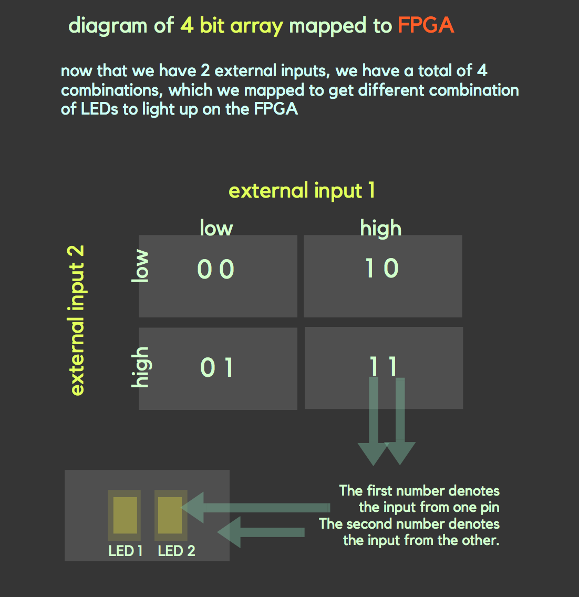

The ultimate goal is to be able to map the robot's path through the maze on a screen using a FPGA and a VGA. In order to do this, the lab was split into multiple steps, each of which will help us achieve that ultimate goal in a later lab: 

- Reading external inputs to FPGA, 
- Correctly updating a 4-bit array dependent on the inputs, 
- Drawing one box on the screen
- Description of how the DAC on the provided VGA connectors works and how the resistor values were chosen, 
- Mapping external inputs to four different outputs on the screen.


## Reading external inputs to FPGA

For the first part, we basically want to show the FPGA is reading an external input. We decided to do this by toggling one of the FPGA LEDs to turn on if the external input was running high, and off if the external input was low. 

So now we have to decide what we want to use to produce the external input. In the end, we decided to use pins on the arduino, since this would allow the flexibility and easy manipulation of outputs since we can code it all via Arduino programming. 

However, one note here is that the arduino pins output 5V, but the FPGA only accepts up to 3.3V. In order to make up for this difference, we used a voltage divider with resistances of roughly 800ohms and 500ohms to turn a 5V based output from the arduino into a 3.3V based input for the FPGA.


To review, we program the arduino outputs, which subsequently go through the voltage divider, which then enter the FPGA as an external input. We will then code the FPGA to toggle the LED on or off based on the external input. 


To best demonstrate this, we programmed the arduino pin to toggle from LOW to HIGH every 2 seconds using the following code within the loop:

```
  //External input to FPGA
  //should toggle from HIGH to LOW every 2 seconds
  
  digitalWrite(Pin1, LOW);         // sets the pin low
  digitalWrite(LED_BUILTIN, LOW);  //sets the LED low (just a marker)
  delay(2000);                     // waits for 2 seconds
  digitalWrite(Pin1, HIGH);        // sets the pin high
  digitalWrite(LED_BUILTIN, HIGH); //sets the LED high (just a marker)
  delay(2000);                     // waits for 2 seconds

```

In our Verilog code for the FPGA, we merely had to equate the LED's current state, led_state, with the external input, such that the HIGH of the external input corresponds to the HIGH of the led_state, and the LOW with the LOW. We did this using the following code:
```
  always @ (posedge CLOCK_50) begin
        CLOCK_25 <= ~CLOCK_25; 
  		  if (GPIO_0_D[0]== 1'b0) begin
				led_state   <= 1'b0;
		  end
		  else if (GPIO_0_D[0]==1'b1) begin	
				led_state   <= 1'b1;
		  end 
	 end
```

Note in the above code, GPIO_O_D[0] was our external input and led_state refers to the LED's current state.

[See the demo here](https://youtu.be/QqNK1ildkJI)


## Correctly updating a 4-bit array dependent on the inputs

This is similar to the external input to the FPGA with one added aspect. Since we want a 4 bit array, or essentially a 2 by 2 grid array, we can use two inputs from the arduino and map each part of the grid to the corresponding LED on the FPGA.



For the arduino code, we had two outputs, but we wanted to use these outputs to create a total of 4 combinations, as seen on the diagram. As such, we programmed it to toggle through LOW LOW, LOW HIGH, HIGH LOW, and finally HIGH HIGH for output pins 1 and two respectively. This can be seen in the following code.

```
  //4 bit array mapped to LEDs on FPGA
  //should iterate through 00, 01, 10, 11 
  //2 second intervals
  
digitalWrite(Pin1, LOW);      // sets both the pins low
digitalWrite(Pin2, LOW);      
delay(2000);                  // waits for 2 seconds

digitalWrite(Pin1, LOW);      // sets pin1 low
digitalWrite(Pin2, HIGH);     // sets pin2 high
delay(2000);                  // waits for 2 seconds


digitalWrite(Pin1, HIGH);     // sets pin1 high
digitalWrite(Pin2, LOW);      // sets pin2 low
delay(2000);                  // waits for 2 seconds


digitalWrite(Pin1, HIGH);     // sets both pins high
digitalWrite(Pin2, HIGH);     
delay(2000);                  // waits for 2 seconds
```
For the Verilog code, the only thing that would change is that we need to add another external input and equate it to a second led_state as seen in the following:

```
    always @ (posedge CLOCK_50) begin

        CLOCK_25 <= ~CLOCK_25; 
  		  if (GPIO_0_D[0]== 1'b0) begin
				led_state   <= 1'b0;
		  end
		  else if (GPIO_0_D[0]==1'b1) begin	
				led_state   <= 1'b1;
		  end 
		  
		  if (GPIO_0_D[1]== 1'b0) begin
				led_state2  <= 1'b0;
		  end
		  else if (GPIO_0_D[1]==1'b1) begin
				led_state2  <= 1'b1;
		  end

```
[See the demo here](https://youtu.be/0PuzwThnux0)

Also here is an image of our voltage divider connected to the arduino and FPGA.


## Drawing one box on the screen

## Description of how resistor values were chosen

* We had three resistors for red and green and two resistors for blue color output from the VGA.
* The resistor values were calcuated by using the concept of voltage division. 
* We calcualted the voltage drop across the 50 Ohm resistor (labeled R4) by turning on only one resistor connected to the VGA pin. 
* The voltage drop across R4 was determined by the bit that is one and each bit generates an output voltage that is twice the voltage output of the next least significant bit. 
* For Red and Green colors

   | Resistor    | Voltage output|  Voltage  |calculated | Measured|
   | ----------- | ------------- |-----------|---------- |-------- |
   | R1  (MSB)   | V1=2V2=4V3    | 4/7V      |238.75Ohms |         |
   | R2  (2nd MSB| V2=2V3        | 2/7V      |527.5Ohms  |         |
   | R3  (3rd MSB| V3            | 1/7V      |1105Ohms   |         |
   
   * Voltage computations:
   
   *V1+V2+V3 = 1V*
   
   *4V3+2V3+V3 = 1V*
   
   *7V3= 1V*
   
   *V3= 1/7V*
   
   * Resistance computations:
   
   _Vin= 3.3V (input to FPGA)_
   
   _Vi = [R4/(R4+Ri)] x Vin , i= 1,2,3_ 
   
  * For Blue color
  
   | Resistor    | Voltage    |  Voltage  |Calcualted|
   | ----------- | -----------|-----------|----------|
   | R1  (MSB)   | V1=2V2     | 2/3       |197.5Ohms |
   | R2  (2nd MSB| V2         | 1/3       |445Ohms   |
   
   Voltage computations:
   
   *V1+V2 = 1V*
   
   *2V2+V2 = 1V*
   
   *3V2= 1V*
   
   *V2= 1/3V*
   c
   ### External Input
   Reistor values 464.8 Ohms and 895 Ohms
   divider voltage value 3.37 volts
   ## Mapping external inputs to four different outputs on the screen.
   
   [See the demo here](Mapping external inputs to four different outputs on the screen.)
  
  
  
   
