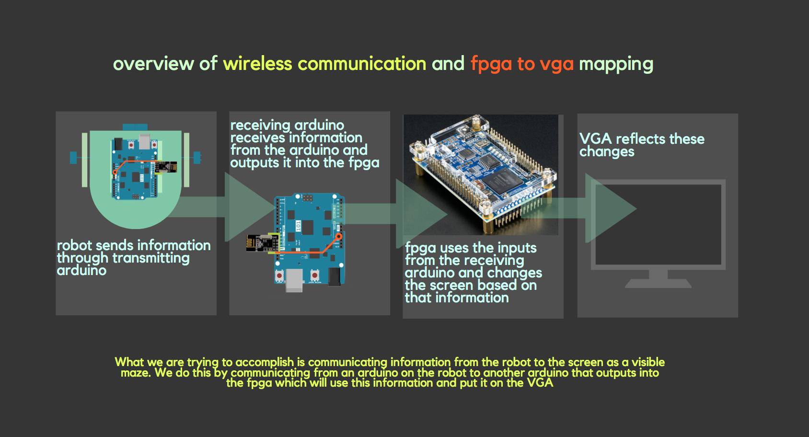
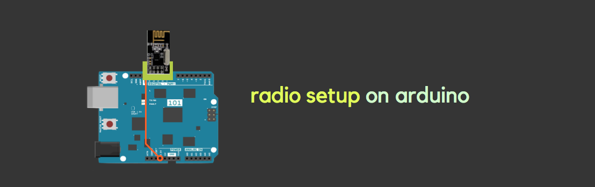
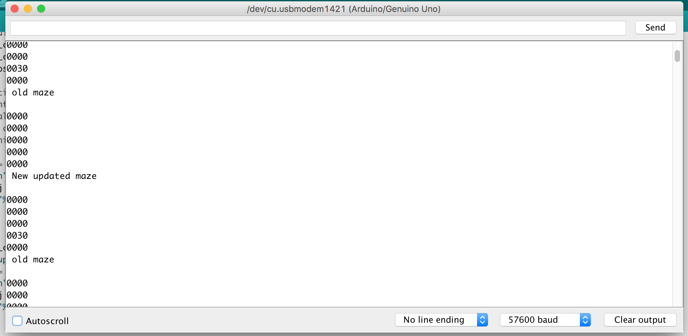
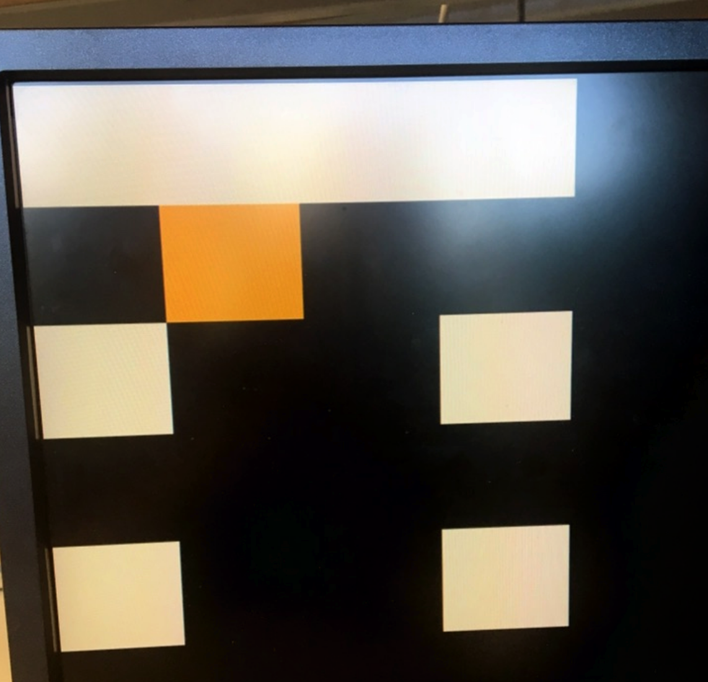

# Lab 4
The main goal of this lab is visual mapping of communicated information. The finished robot will have to communicate wirelessly to us to update information on the maze that it is mapping. This will enable us to map the maze visually onto the computer. Thus this lab was broken up into two subteams: radio and FPGA.  The radio subteam implemented the communication while the FPGA subteam figured out how to use the communicated data received to finish the maze mapping on the screen by continuing off from the previous lab.[click here to see the original lab manual](https://cei-lab.github.io/ece3400/lab4.html)

The following is a visual representation of what we hope to achieve. 



## Radio Team

The main goals of radio team are:
* Sending information wirelessly between Arduino’s
* Sending the entire maze wirelessly
* Updating the maze array, dependent only on the updated robot information
* Communicating maze information from the Arduino to the FPGA

Materials used:
* 2 Nordic nRF24L01+ transceivers
* 2 Arduino Unos (one must be shared with the other sub-team)
* 2 USB A/B cables
* 2 radio breakout boards with headers

A little background information on the nRF24L01+: 
* is a wireless communication device
* is low cost 2.4GHz tranceiver ( transmitter + receiver) which as a built in antenna
* communicates with Arduino using Serial Peripheral Interface (SPI) which is a data protocol used by microcontrollers for communicating with one or more peripheral devices quickly over short distances 
* has communication addresses called pipes

For more info check out this [Website](https://www.nordicsemi.com/eng/Products/2.4GHz-RF/nRF24L01P).


# Setting up and preliminary work

We started first by downloading and installing the [RF24 Arduino library](https://github.com/maniacbug/RF24) however, we did not use the Getting Started sketch that was there, instead we replaced it with one provided to us from the 3400 course website. Then we set up the radio. Each radio was connected to a level-converter which was then connected to the arduino. On the level converter is a 3.3V power pin, which we soldered a wire and connected to the 3.3V on the arduino as well. 



We assigned the address numbers for the two pipes using the formulae below : in this case they represent the address of transmitter(0) and receiver(1). 

     2(3D + N) + X: D=4 for friday, N=16 team number, X=0 for radio 1 , X=1 for radio 2

* #### _Sender-> has 0_
  #### _2(3*4+16)+0=56_
  #### _In hex: 38_

* #### _Receiver-> has 1_
  #### _2(3*4+16)+1=57_
  #### _In hex: 39_

We then used these numbers in the following code for the pipe addresses. Note that in the code, Ping_out for and ping_back roles are for transmitting and receiving roles respectively.

```arduino

// Radio pipe addresses for the 2 nodes to communicate.
const uint64_t pipes[2] = { 0x0000000038LL, 0x0000000039LL };
...

if ( role == role_ping_out ) 
  { // sending
    radio.openWritingPipe(pipes[0]);
    radio.openReadingPipe(1,pipes[1]);
  }
  else
  { // role_ping_back to sender
    radio.openWritingPipe(pipes[1]);
    radio.openReadingPipe(1,pipes[0]); 
}
...
```

# Sending information wirelessly between Arduino’s

Now that we've set up the basics, this first task is really just to test to see if everything is set up correctly. If we are able to send and receive any information at all, we can know that the radios have been set up correctly, and then move on to more complicated communications.

In the following demo, you can see information about the communication being transmitted back and forth. Specifically the **transmitting** radio sends the information to the **receiving** radio. Then, immediately after the **receiving** radio reads the value, it will output a signal telling the **transmitting** radio that it has received the information successfully.

[Watch the demo here](https://youtu.be/6SE5Zzr0TsY)

# Sending the entire maze wirelessly

Now that the basic communication is working, we wanted to send a 4X5 matrix representing the maze from one arduino and receive it correctly on the other. This requires a bit more code than whhat is originally in the Getting Started sketch.

To simulate sending a maze, the **transmitting** radio first defined a maze. We used the following maze, added near the top of the **transmitting** radio's code:

```arduino
unsigned char maze[5][4] =
{
  3, 3, 3, 3,
  3, 1, 1, 1,
  3, 2, 0, 1,
  3, 1, 3, 1,
  0, 0, 0, 0,
};
```
Using similar code to when we sent the unsigned long, we sent the maze using the following code. Note that this occurs within role_ping_out within the void loop.


```arduino
printf("Now sending the maze!\n");
bool ok = radio.write( maze, sizeof(maze) );

if (ok)
  printf("ok...");
else
  printf("failed.\n\r");
  ```
  
On the **receiving** radio's end we added the following code. First we have to read the maze, then since we want it to print in a format of a maze, we included the for loops. Again, this code must be within the role_pong_back within the void loop.

```arduino
//ADDED RECEIVER CODE STARTS
unsigned char got_maze[5][4];
bool done = false;
while (!done)
{ 
  // Fetch the maze.
  done = radio.read( got_maze, sizeof(got_maze) );

  // Print the maze
  for (int i=0; i < 5; i++) {
    for (int j=0; j < 4; j++) {
      printf("%d ", got_maze[i][j]);
    }
    printf("\n");
  }

  delay(20);

}
```

[Watch the demo here](https://www.youtube.com/watch?v=UpGTPtXO6Dk)

# Updating the maze array, dependent only on the updated robot information

When we are actually maze mappping, the robot has to send a lot of different information regarding the state of the robot and what it detects in real time. We also need to develop a system to put a signal that is easy to send through, such as having all the information within a single byte, which is what we ended up doing.

This is how we decided to encode our information so we can send it.

Pack the bits in this pattern

x_coord | y_coord | data

2 bits  | 3 bits  | 3 bits

For the data part, we had to include several components of the state such as whether or  not the wall is visited, whether or not there is a wall, or treasure, and if there is a treasure, what kind of treasure is it? The below is how we decided to sort the information.

000-> unvisited
001-> visited
010-> wall
011-> treasure 7khz
100-> treasure 12khz
110-> current position
101-> treasure 17khz
111-> robot location

As for our arduino code, it is again very similar to before, with the exception that we need to pack the information as a byte. Within the **transmitting** radio's code we added the following. Again, this code occurs within role_ping_out within the void loop. 

The test data are just values we inputted manually into the code. This will eventually be replaced by the robot's actual signals.


```arduino
// Test data
unsigned char x_coord = 4;
unsigned char y_coord = 4;
unsigned char pos_data = 3;

// Use bit shifting to pack the bits
// For deployment with a robot, something like this should be factored out into
// a function, along with the code to unpack the bits
new_data = x_coord << 5 | y_coord << 2 | pos_data;
// For the test case of (5, 5, 3) the byte shoud look like: 10010011
// In decimal this is 147

// Take the time, and send it.  This will block until complete
printf("Now sending new map data\n");
bool ok = radio.write( &new_data, sizeof(unsigned char) );

  ```
  
On the **receiving** radio's end we added the following code. Again, this code must be within the role_pong_back within the void loop.

```arduino
unsigned char got_data;
bool done = false;
while (!done)
{
  // Fetch the payload, and see if this was the last one.
  done = radio.read( &got_data, sizeof(unsigned char) );

  // Spew it
  // Print the received data as a decimal
  printf("Got payload %d...",got_data);

  delay(20);

}

```

[Watch the demo here](https://youtu.be/Q6yj9YIcTcg)

Since we have to update the maze matrix continuouly to reflect changes that the robot detectx, we want to write the state information in the correct current robot position. Recall that of the byte we sent and received, the first two bites corresponded to the x and the next three correspond to the y. Thus in our arduino code, we used these values to get to a certain index within matrix and then change that value based on the state bits which are the last three bits of the byte.

```arduino


    for (int i = 0; i<5; i++) {
      printf("\n");
      for (int j = 0; j <4; j++) {
        printf("%d", maze[i][j]);
      }
    }

maze[x_coord][y_coord] = pos_data;
printf("\n New updated maze \n");
    for (int i = 0; i<5; i++) {
      printf("\n");
      for (int j = 0; j <4; j++) {
        printf("%d", maze[i][j]);
      }
    }
    printf("\n old maze \n");
    
```




In this picture you can see we have the old matrix and then updated it to reflect the new state at the current x and y.


# Communicating maze information from the Arduino to the FPGA

Now that we are successfully getting information from the **first transmitting arduino** on the robot to the **second receiving arduino** connected to the FPGA which is connected to the VGA, we need to get the receiving arduino's information and relay it to the FPGA.

There are many ways to do this, including parallel and serial communication. In the end we decided on using SPI, which is harder to implement but saves pins. To learn more about SPI on arduino, [use this link](https://www.arduino.cc/en/Reference/SPI)

We implemented SPI on the arduino [here](spi.ino). However we forgoed a MISO pin since the FPGA will never have to write to the arduino. In the example, we entered some data 10010010 through the MOSI pin and got the following on the oscilloscope:


In the following demo, we can be sure that the FPGA received the information correctly, since the graphics subteam coded in verilog such that the LEDs will light up for a low signal and turn off for a high signal. In the video, the FPGA's LEDs correspond correctly to the 10010010 we sent through the arduino.

[Click here for the demo!](youtubestuff)

## Graphics Team

* Displaying a full 4-by-5 grid array on the screen
* Display the robot location on the screen
* Distinguish what sites have been visited and which haven’t on the screen

The radio subteam went as far down the road of communication to send the robot state information through the receiving arduino to the FPGA. Now we are focused on taking that byte of information and turning it into a set of data which we can then translate visually onto the VGA.

# Displaying a full 4-by-5 grid array on the screen

In lab 3, we created 2-by-2 grid on the screen. To make the 4-by-5 grid, we just added more if statements to make the whole 4-by-5 grid. In the FPGA, we assigned the color white to all of the boxes and applied black to the rest of the screen. A pixel's color is determined by its position on the screen. If the pixel is within the bounds of a box with a color other than black, then its color is the color of the rest of the box.  

The code below determines the color of the box in the top left color

``` verilog
     if(PIXEL_COORD_X < 10'd64 && PIXEL_COORD_Y < 10'd64)begin
	     PIXEL_COLOR <= grid[0][0];
		if(PIXEL_COORD_X == 63 && PIXEL_COORD_Y == 63) begin
		     counter <= counter + 1;
		end
	end
```


# Display the robot location on the screen
The current location of the robot will be indicated by a orange colored block in the grid. In order to capture the entire maze's information, the FPGA receives a byte for every block in the grid. The first 5 bits encodes the x and location in the grid, correspondeing to a matrix position. The last 3 bits encode the state of that block in the grid. If the state is 110, then that block is colored orange to show the robot's current location.

The different states are repeated here for convenience along with their color assignments:

- Unvisited-> 8'b11111111 WHITE
- Visited-> 8'b11111100 YELLOW
- Wall-> 8'b00111111 TEAL
- 7KHz treasure-> 8'b11100000 RED
- 12KHz treasure-> 8'b00011100 GREEN
- 17KHz treasure-> 8'b00000011 BLUE
- Current Position-> 8'b11101100 ORANGE

In order to update colors, we check the state in the signal at every clock edge as in the following code:

```verilog
	if (out[2:0] == 3'b000) begin
		grid[out[7:6]][out[5:3]] <= unvisited;
	end
	else if (out[2:0] == 3'b001) begin
		grid[out[7:6]][out[5:3]] <= visited;
	end
```
The colors are stored in the grid register. Based on the 3 bit encoding we update the color stored in the grid that is then rendered on through the VGA.



To test this out we outputted a dummy matrix into the arduino. In our dummy matrix, we set all of the boxes as being unvisited and set the matrix box in the position 01001 (so the second box to the left and the second box down) as being the current position.

As seen in the above image, we had some glitches regarding some of the boxes not showing up, however, it still correctly displays the current position and outputs the right color.

# Distinguish what sites have been visited and which haven’t on the screen
We use the same functionality as displaying the current robot location on the screen. The arduino sends signals through the SPI to indicate which sites in the grids are visited and which are not visited. This information is used by the FPGA to set the appropriate color.
