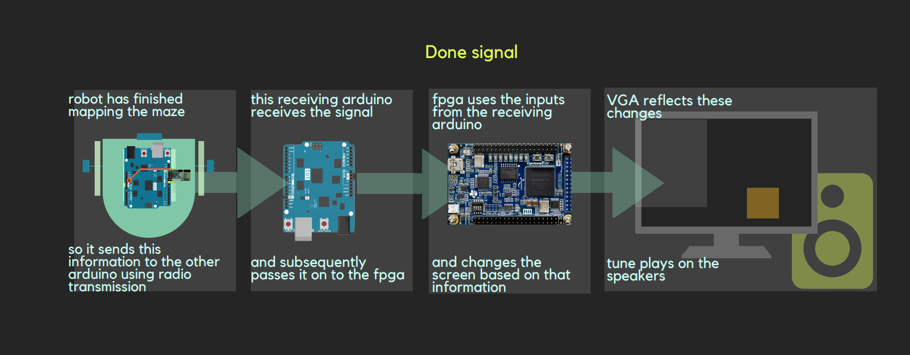

# Milestone 4

The purpose of this milestone was to put all of the parts together. This mainly included adding the dfs code from the previous to the radio transmission code for the arduino on the robot's side, and adding the radio receiving code to the fpga vga code. 

The way we implemented our dfs incorporated a separate visited matrix, separate wall matrix and the robot's x and y position. Thus we added a simple helper function to shift the bits from each part and add them together to create our 16 bits of information


# Displaying walls
In order to display the walls on the FPGA the first thing we need is to set up the SPI transmission from the Arduino. The Arduino sends a 16 bit signal to the FPGA. 
  * The first 2 bits represent X axis position (0,1,2,3) and next three bits represent Y axis position ( 0,1,2,3,4) for drawing the 4     by 5 maze
  * The next three bits represent the state of the robot such as current state, visited, unvisited, treasures (7kHz,12kHz,17kHz)
  * The next four bits represent the 4 possible positions of walls ( north, south, east, west)
  * The last bits are not used or this milestone but we will use them in our final implementation
  
  
  
 In order to recevie data from the Arduino, we added another FPGA code that receives each bit sent from the Arduino, and stores them in an out variable that is used in the DE0_NANO.v code to draw the maze.
 ```verilog
 module RECEIVE (
	CLOCK,
	DATA,
	ENABLE,
	OUT
);

...
always @(posedge CLOCK) begin
  if(ENABLE) begin
  	accumulate[index] <= DATA;
	if(index == 4'b1111) begin
	     pastOut <= accumulate;
	end
	else begin
	    pastOut <= 16'b1111111111111111;
	end
	index <= index + 1;
	end
  end
 ```
Drawing the maze mainly included setting the correct x and y position of the grid. A color was assigned to each grid depending on the values sent from the arduino. 
For example if the input from the arduino is 0000011010010000 then starting from the most significant bit the first two and second three zeros signify the is in the (0,0) position with 110 representing that the robot's current position is also in grid (0,0). The next four bits show that there is a wall to on the global north and west side which is the default case. The last four bits aren't used right now.  

The code implementation of this could be as follows: since north and west walls exist by default according to our implementation, the robot only has to check or south and east walls. 
```
assign current = 8'b00111110; // light brown

always @ (posedge CLOCK_50) begin
...
else if (out[10:8] == 3'b110) begin
	grid[out[15:14]][out[13:11]] <= current;
end
...

else if(PIXEL_COORD_X < 10'd64 &&  PIXEL_COORD_Y < 10'd64)begin // COLUMN 1
	PIXEL_COLOR <= grid[0][0];
	if(wall_pos[2][0][2] ==  1'b1) begin//South
	if (PIXEL_COORD_X >= 10'd0 && PIXEL_COORD_X <= 10'd64 && PIXEL_COORD_Y >= 10'd60 && PIXEL_COORD_Y <= 10'd64)begin
		PIXEL_COLOR <= wall; 
		end			
	end
	if(wall_pos[2][0][1] ==  1'b1) begin//EAST
	if (PIXEL_COORD_X >= 10'd60 && PIXEL_COORD_X <= 10'd64 && PIXEL_COORD_Y >= 10'd0 && PIXEL_COORD_Y <= 10'd64)begin
		PIXEL_COLOR <= wall; 
		end

	end
end

```
# Simulation for Signaling "done" and detecting Treasures

For testing the done signal and treasures on a simulation, we made a simple arduino simulation code that changes the current position representing the robot's motion. 

We first programmed the FPGA to change colors depending on the bits allocated for treasure on the 16 bit information from the arduino. The treasure colors vary based on the frequency a treasure sensor detects. 

```
else if (out[10:8] == 3'b011) begin
	grid[out[15:14]][out[13:11]] <= seven; // red
	end
	else if (out[10:8] == 3'b100) begin
	grid[out[15:14]][out[13:11]] <= twelve; // green
	end
	else if (out[10:8] == 3'b101) begin
	grid[out[15:14]][out[13:11]] <= seventeen; // blue
end
```
As the robot moves to the grid with the treasures these colors blink which is similar to what would happen during the actual robot's motion. 

When the robot finishes mapping the maze, it has to send a signal to the separate arduino connected to the FPGA or to our base station. We want to signal that the robot has finished on both the visual display as well as by our finished tune from a speaker.

Below is a visual of how the process should work.
  

We allocated a separate signal for the done. The arduino on the robot will set this signal high once it has finished, and send it to the arduino which will then send it to the FPGA. We coded the FPGA to draw an orange square on the outside of the matrix once it has finished and also start the tune.

# What would happen in the actual Maze
For the actual maze implementation, we needed make some modifications from the previous dfs and transmission code. To do this we need to have two radios that transmit and receive signals related to current position, treasure, and walls.

In our previous dfs code we had a separate matrix for walls, visited state and the robot's X and Y. We made a simple helper function to consolidate this information into one 16 bit piece, and put each of those into the 5 by 4 matrix to send to the receiving arduino at the base station.

In order to do this we modified and merged the code from lab 4 and milestone 3. Previously, in lab 4 the 4 by 5 maze was declared as an input to the arduino. However, in this simulation this data should be received from the maze and no input code is required. 

Therefore, this part will be similar to the simulation except that the robot itself does the simulation. 

This part of the lab is not fully complete. Our Depth first Search for the maze mapping works except for the backtracking algorithm. 
Below are the links or our full DFS code and radio communication which we will imporve and get to fully function for the final competition. 

* [Receiving radio code](radioandFPGA.ino)
* [Transmitting code merged with DFS](merged.ino)

