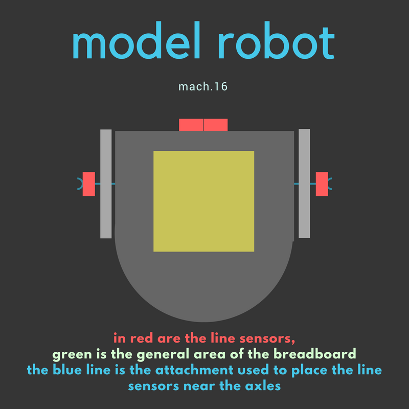
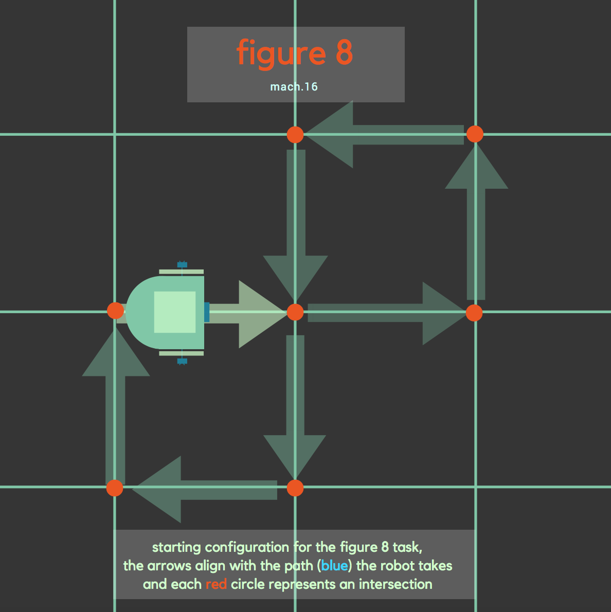

# Milestone 1

## For this milestone, we have 2 important goals to acheive:
  * A robot that successfully follows a line of black tape.
  * A robot that successfully traverses a grid of black tape in a figure eight.
  

To complete this milestone, we first had to add line sensors to our original lab 1 prototype. Learn more about line sensors here: [line sensors](https://www.sparkfun.com/products/9453)

Here is a diagram of our line sensor placement on the prototype:

1. Following a line

In order to make the robot follow a straight line, we first tested the different values the line sensor generates. The threshold value was around 750. If it is above 750, the line is black; otherwise it is in the white space. 

2. Making a figure 8

