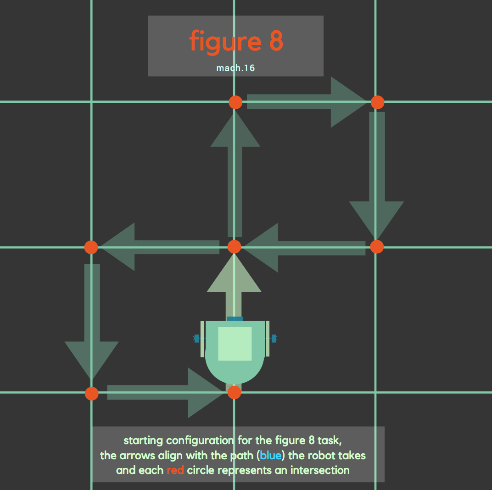
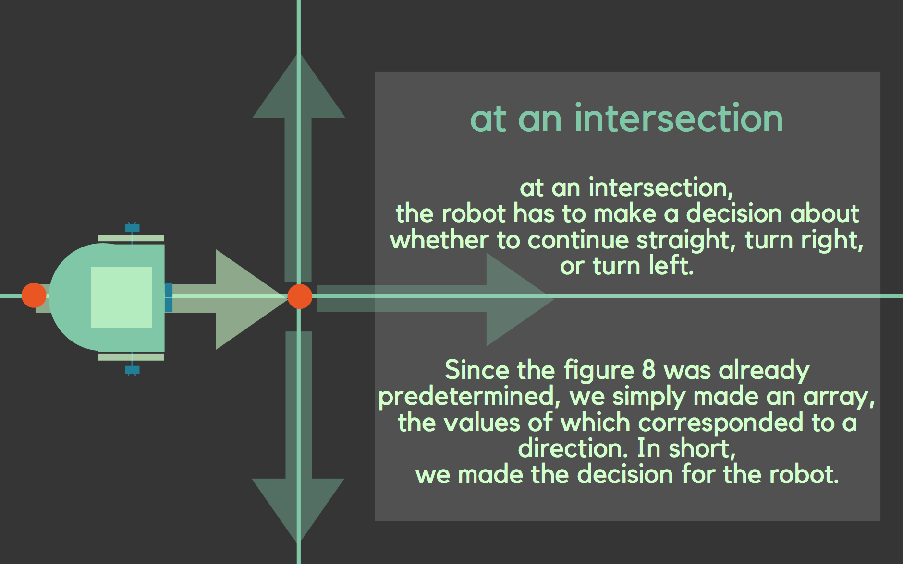
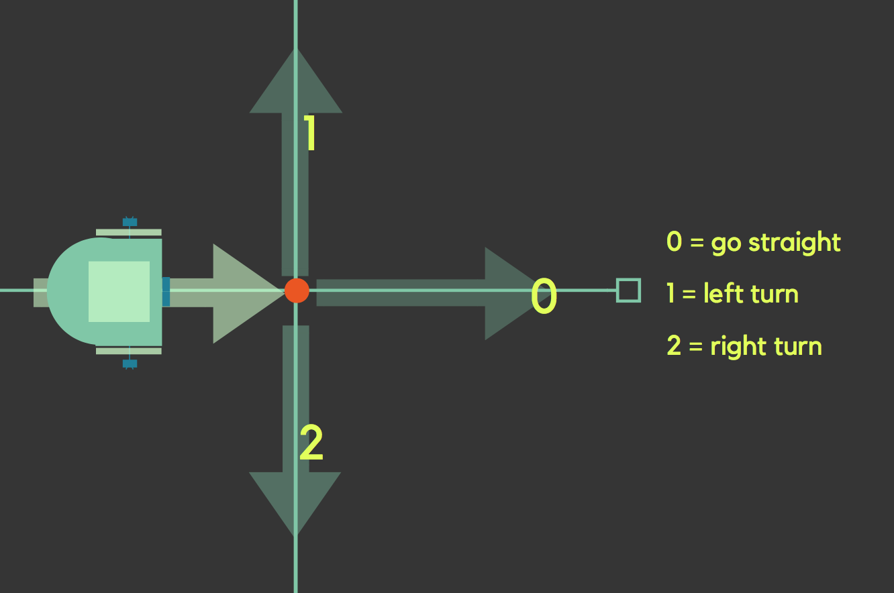
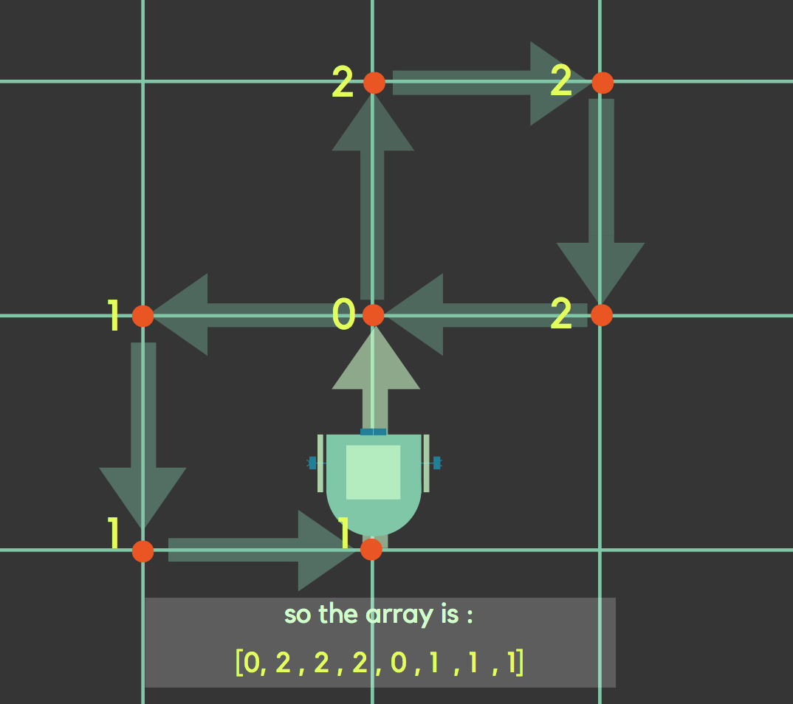

# Milestone 1

## For this milestone, we have 2 important goals to acheive:

  * A robot that successfully follows a line of black tape.
  
  * A robot that successfully traverses a grid of black tape in a figure eight.
  
  
  

To complete this milestone, we first had to add line sensors to our original lab 1 prototype. Learn more about line sensors here: [line sensors](https://www.sparkfun.com/products/9453). We then made the robot follow the line of black tape before we were able to make it turn, and then subsequently make it go in a figure 8 pattern. 

Here is a diagram of our line sensor placement on the prototype:


 


## 1. Following a line
In order to make the robot follow a straight line, we first tested the different values the line sensor generates. We picked the thresold value that separates black and white lines to be 750. 

  * If threshold > 750 black else white

The line following sensors were placed on the front middle side of the robot and were tied together to make the data captured by both as similar as possible. 

(picture for front sensor position)

The algorithm compares the values generated by the the left and right middle sensors to enable the forward motion. 

 ###  Pseudocode
 
 ``` arduino
  If (middleLeftVal > 750 && middleRightVal < 750) {
    move right with max speed 
    slow down left
  }
  If (middleLeftVal < 750 && middleRightVal > 750) {
    move left with max speed
    slow down right
  }
  If (middleLeftVal > 750 && middleRightVal > 750) {
    move both with max speed
}
```

(video for line following)

## 2. Making a figure 8


The following diagram shows how we want to configure our robot to make a figure 8 within the grid.



At each intersection, the robot has to decide whether to go straight, make a right turn, or a left turn.



We made the decision for the robot by giving each possible route a number value, as seen below.



Then we made an array for the complete set of values that corresponded to a figure 8, which can be seen in the next diagram.




Thus by iterating through each value of the array, the robot will make a figure 8, and once it finishes one cycle, we coded such that the robot will restart a new cycle by starting the array once more, and continue in a figure 8 path.

### Coding

Now that we've explained the basics, we will explain specifically how we achieved each part (finding an intersection, going straight, left turn, right turn)


GOING STRAIGHT: Going straight followed the same procedure as line following, however, we changed the threshold level to 800 from the 750 we previously had, just an adjustment for the two sensors outside each axle. Again, recall that the value corresponding to going straight at each intersection is 0.

